# 📊 Customer Funnel Analytics

<div align="center">

### End-to-End Data Analytics Project using Python, SQL, Excel & Power BI


</div>

---

# 🚀 Live Demo
🌐*Interactive Streamlit Dashboard:* 
(https://customer-funnel-analytics.streamlit.app/)

---

# 📌 Project Overview

This project demonstrates a complete end-to-end Data Analytics workflow using a **Customer Funnel & Marketing Analytics Dataset**.

The objective was to transform raw customer session data into actionable business insights by combining **Python, SQL, Excel and Power BI** into a single analytics pipeline.

The project follows a real-world analytics workflow:

- Data Cleaning & Preprocessing
- Feature Engineering
- SQLite Database Creation
- SQL Business Analysis
- Python Data Visualization
- Excel Reporting
- Interactive Power BI Dashboard

The final solution enables business stakeholders to monitor customer acquisition, marketing performance, conversion rates and revenue through an interactive business intelligence solution.

---

# 🎯 Business Problem

Digital businesses invest heavily in marketing channels and promotional campaigns, but customer acquisition alone does not guarantee business growth.

This project answers key business questions such as:

- Which marketing channel performs best?
- Which campaigns generate the highest revenue?
- Where do customers leave the purchasing funnel?
- Which devices convert better?
- How do new and returning users behave?
- Which regions contribute the highest revenue?
- Do discounts improve customer conversion?
- How does funnel performance change over time?

---

# 📂 Dataset

**Dataset:** Direct-to-Consumer E-Commerce Funnel Dataset

The Direct-to-Consumer (DTC) E-Commerce Funnel Dataset simulates the customer journey across an online retail platform. It captures user interactions from website visits through product views, cart additions, checkout and final purchase, enabling conversion funnel analysis and marketing performance evaluation.

The dataset contains information about:

- User Sessions
- Website Visits
- Product Views
- Add-to-Cart Events
- Checkout Activity
- Purchases
- Marketing Channels
- Campaign Types
- Customer Devices
- Geographic Regions

Dataset Highlights:

- 120,000 Customer Sessions
- Complete Purchase Funnel
- Marketing Channel Data
- Campaign Performance
- Device Information
- Customer Journey Tracking
---

# 🛠 Tech Stack

| Category             | Technologies       |
| -------------------- | ------------------ |
| Programming          | Python             |
| Data Processing      | Pandas, NumPy      |
| Database             | SQLite             |
| Query Language       | SQL                |
| Visualization        | Plotly             |
| Spreadsheet Analysis | Microsoft Excel    |
| Dashboarding         | Microsoft Power BI |
| Version Control      | Git & GitHub       |

---

# 🔄 Project Workflow

```text
Raw CSV Dataset
      │
      ▼
Python Data Cleaning
      │
      ▼
Feature Engineering
      │
      ▼
SQLite Database
      │
      ▼
SQL Business Analysis
      │
      ├──────────────┐
      ▼              ▼
 Plotly Charts    Excel Analysis
      │              │
      └──────┬───────┘
             ▼
      Power BI Dashboard
             ▼
      Business Insights
```

---

# 📈 Analytics Pipeline

The project follows a complete business analytics workflow.

1. Clean raw customer session data using Python.
2. Create additional analytical features.
3. Store processed data inside SQLite.
4. Perform SQL-based marketing and funnel analysis.
5. Generate automated Plotly visualizations.
6. Perform Excel Pivot Table analysis.
7. Build interactive Power BI dashboards.
8. Deliver actionable business recommendations.

# 📈 Python Visualizations (Plotly)

Python was used to automate business reporting by generating publication-quality visualizations directly from SQL query results using **Plotly**.

These visualizations provide quick insights into customer acquisition, marketing performance, conversion rates and revenue before building the final Power BI dashboard.

---

## Customer Purchase Funnel

Visualizes the complete customer journey from website visit to completed purchase, highlighting where customers drop off in the conversion process.

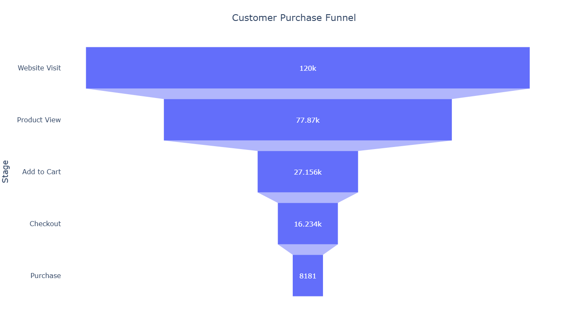

---

## Conversion Rate by Device

Compares customer conversion rates across Desktop and Mobile devices to evaluate platform performance.

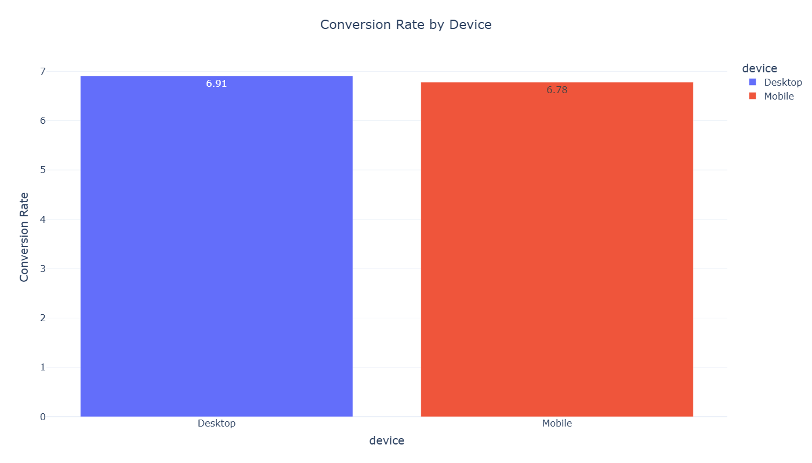

---

## Conversion Rate by Marketing Channel

Shows how effectively different marketing channels convert visitors into customers.

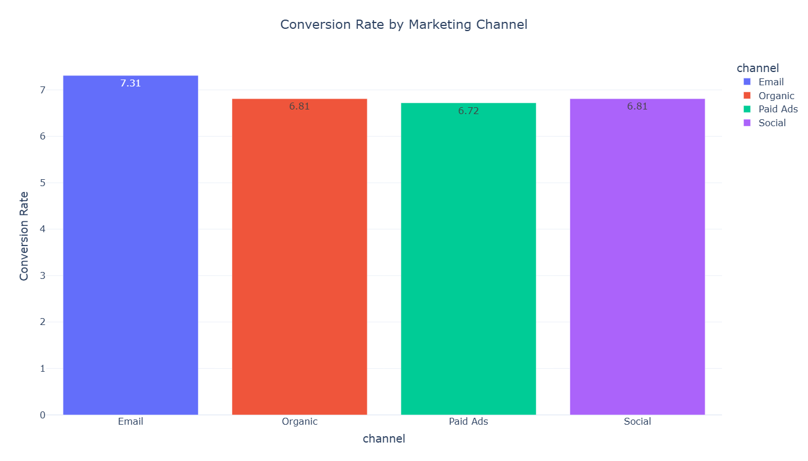

---

## Revenue by Campaign Type

Ranks marketing campaigns based on total revenue generated.

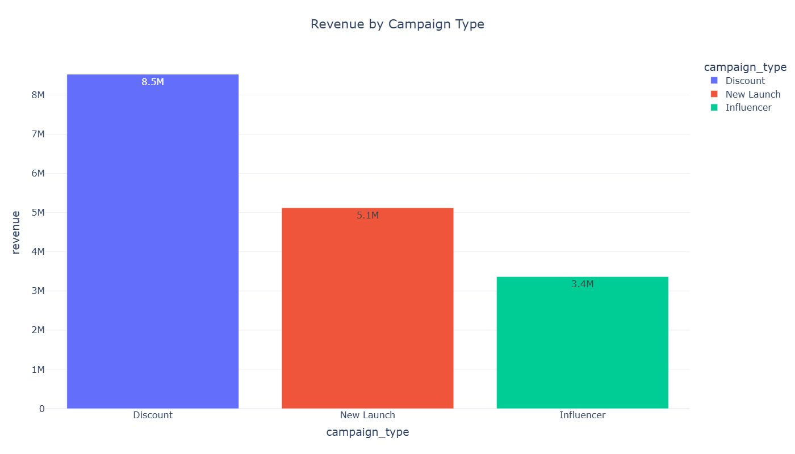

---

## Revenue Contribution by Region

Illustrates the percentage contribution of each region to overall business revenue.

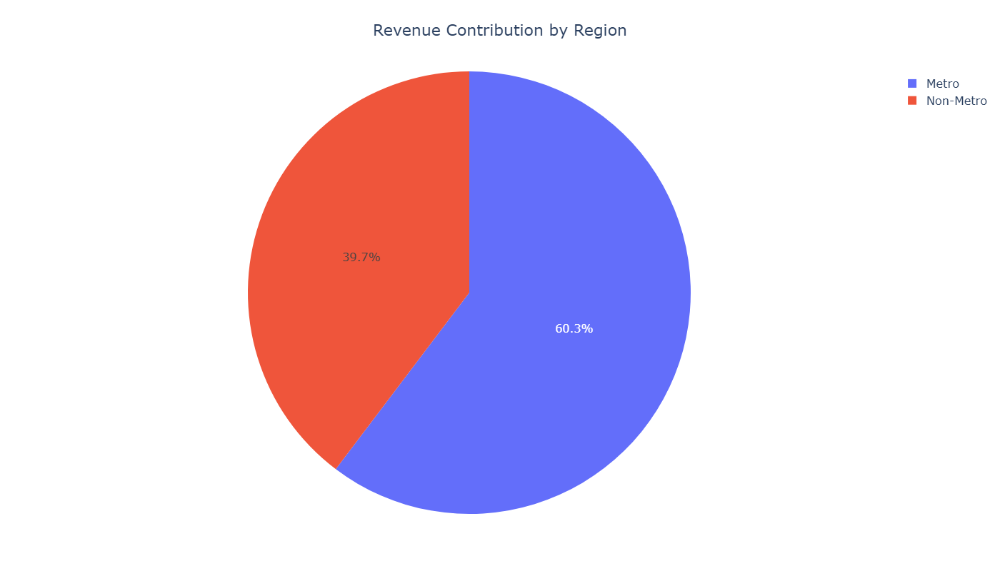

---

## Conversion Rate by User Type

Compares purchasing behaviour between New and Returning customers.

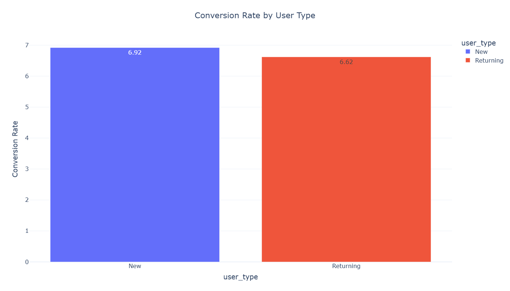

---

# 📊 Microsoft Excel Analysis

In addition to Python and SQL, Microsoft Excel was used to validate business metrics through **Pivot Tables** and **Pivot Charts**.

This demonstrates the ability to perform marketing and customer analytics using one of the most widely adopted business reporting tools.

---

## Marketing Channel Performance

Pivot Tables and Pivot Charts were used to compare customer sessions, purchases and conversion performance across marketing channels.

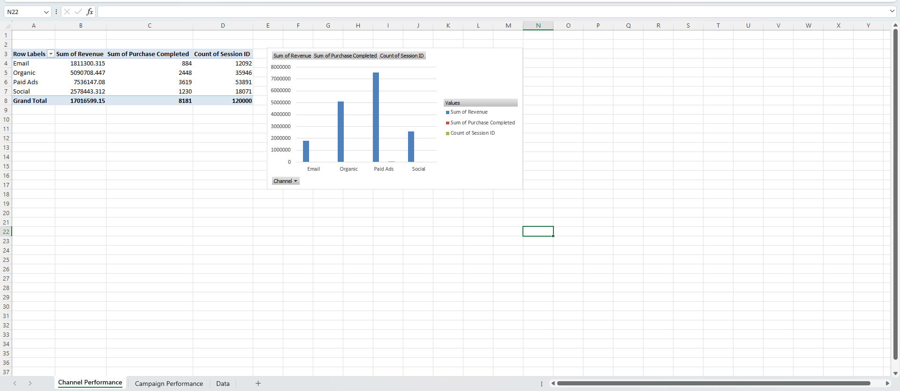

---

## Campaign Performance

Excel Pivot Tables were used to evaluate campaign effectiveness by comparing revenue generation and customer conversion across campaign types.

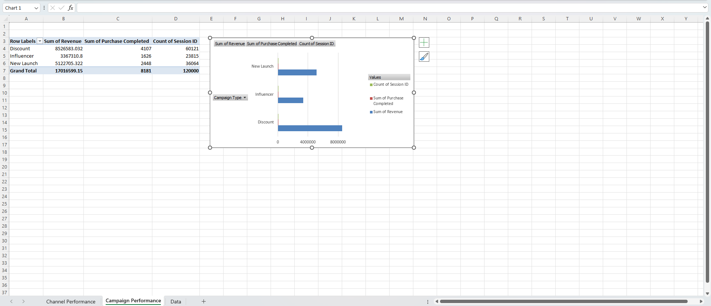

---

### Excel Skills Demonstrated

- Pivot Tables
- Pivot Charts
- Funnel Analysis
- Marketing Performance Analysis
- Revenue Analysis
- Business Reporting

---

### Why Multiple Tools?

Instead of relying on a single platform, the same business questions were answered using multiple analytical tools.

This approach demonstrates the ability to perform consistent analysis across:

- Python
- SQL
- Microsoft Excel
- Power BI

while ensuring that the generated insights remain accurate, reproducible and business-ready.

# 📊 Interactive Power BI Dashboard

The final stage of the project was the development of a multi-page interactive Power BI dashboard.

The dashboard transforms customer session data into business-friendly reports, enabling stakeholders to monitor marketing performance, customer behaviour, funnel conversion and revenue through interactive visualizations.

---

# Dashboard Overview

The report is divided into four analytical pages.

---

## 🏠 Executive Overview

Provides a high-level summary of overall business performance.

**Key Metrics**

- Total Sessions
- Total Purchases
- Total Revenue
- Overall Conversion Rate

**Highlights**

- Monthly Revenue Trend
- Revenue by Region
- Marketing Channel Performance
- Interactive Filters

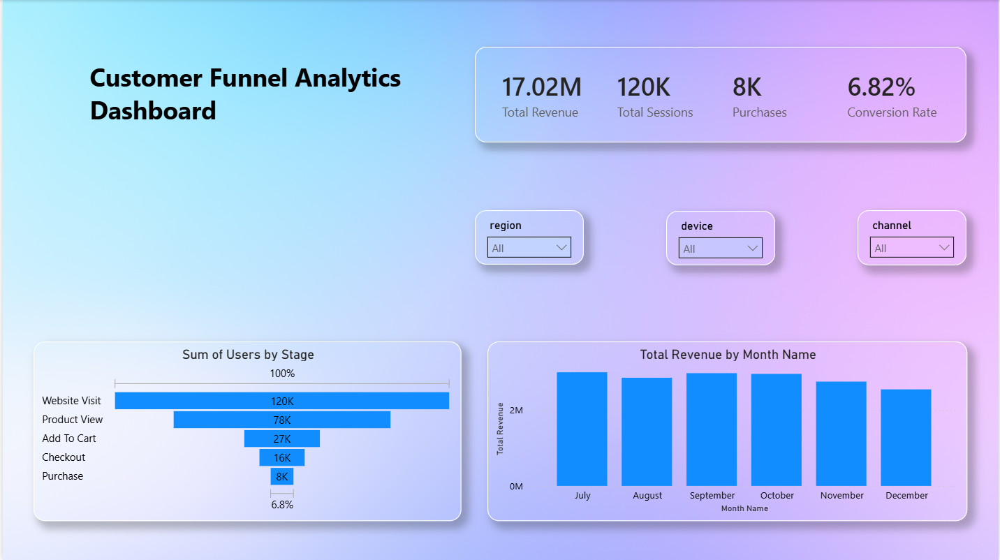

---

## 📣 Marketing Analytics

Evaluates the effectiveness of customer acquisition channels and marketing campaigns.

**Key Metrics**

- Marketing Sessions
- Campaign Revenue
- Channel Conversion Rate
- Campaign Conversion Rate

**Highlights**

- Channel Performance
- Campaign Revenue
- Campaign Conversion
- Marketing Trend Analysis

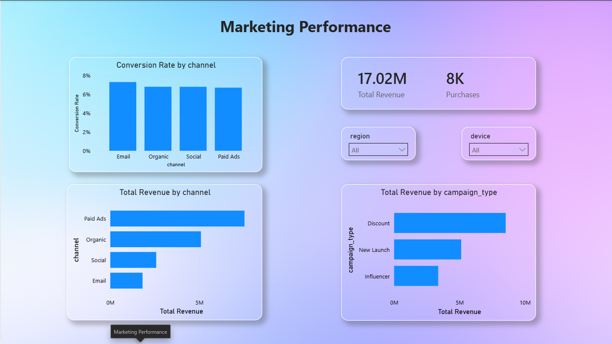

---

## 👥 Customer Analytics

Analyzes customer behaviour and purchasing patterns.

**Key Metrics**

- New Customers
- Returning Customers
- Customer Conversion Rate
- Average Order Value

**Highlights**

- Device Performance
- User Type Analysis
- Customer Revenue
- Regional Comparison

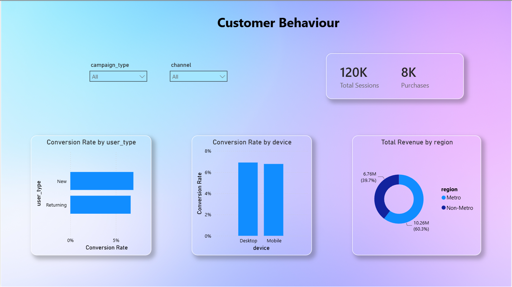

---

## 🔄 Customer Funnel Analysis

Visualizes the complete customer journey from website visit to purchase.

**Key Metrics**

- Website Visits
- Product Views
- Add to Cart
- Checkout Started
- Purchases

**Highlights**

- Funnel Conversion
- Funnel Drop-off
- Conversion by Device
- Conversion by Channel

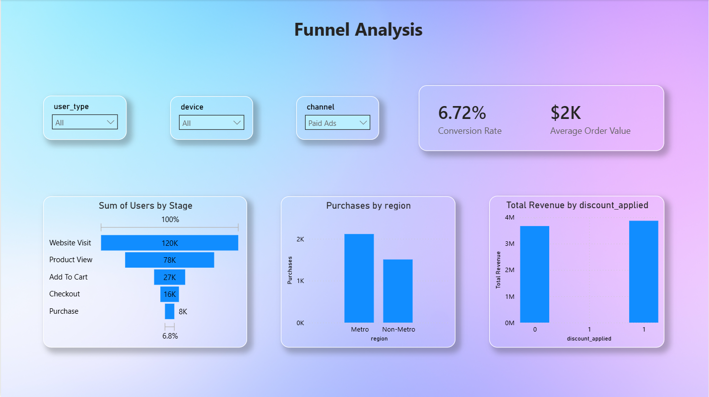

---

# ✨ Dashboard Features

The dashboard supports interactive business analysis through:

- Dynamic KPI Cards
- Interactive Slicers
- Cross-filtering
- Drill-down Visuals
- Multi-page Navigation
- Responsive Business Dashboards

---

# 💡 Key Business Insights

The analysis produced the following business insights.

### 📌 1. Overall funnel conversion rate is **6.82%**, with **8,181 purchases** generated from **120,000 customer sessions**.

---

### 📌 2. The largest customer drop-off occurs between **Product View** and **Add to Cart**, indicating the biggest opportunity for conversion optimization.

---

### 📌 3. Desktop users achieve the highest conversion rate (**6.91%**), while Mobile users generate the highest overall revenue due to significantly larger traffic volume.

---

### 📌 4. Paid Ads generate the highest revenue, while Email Marketing achieves the highest conversion rate (**7.31%**).

---

### 📌 5. Metro regions contribute over **$10.26M** in revenue, significantly outperforming Non-Metro regions.

---

### 📌 6. New customers generate more revenue and convert slightly better than Returning customers.

---

### 📌 7. Discount campaigns contribute the highest overall revenue, demonstrating strong promotional effectiveness.

---

### 📌 8. Funnel analysis identifies clear opportunities to improve customer conversion by optimizing the Add-to-Cart stage.

# 🎯 Business Value

This analytics solution enables business stakeholders to:

- Monitor customer acquisition performance
- Measure marketing channel effectiveness
- Analyze campaign performance
- Identify customer drop-off points
- Track conversion rates across the purchasing funnel
- Compare new and returning customer behaviour
- Evaluate regional revenue contribution
- Support data-driven marketing decisions

---

# 🚀 Getting Started

## Clone the Repository

```bash
git clone https://github.com/KartikeyaWarhade2002/customer-funnel-analytics.git
```

Move into the project directory:

```bash
cd customer-funnel-analytics
```

---

## Create a Virtual Environment

### Windows

```bash
python -m venv .venv
```

Activate the environment:

```bash
.venv\Scripts\activate
```

---

## Install Dependencies

```bash
pip install -r requirements.txt
```

---

# ▶️ Running the Project

Execute the scripts in the following order.

### 1. Prepare the Dataset

```bash
python scripts/prepare_data.py
```

### 2. Execute SQL Analysis

```bash
python sql/analysis.py
```

### 3. Generate Plotly Charts

```bash
python scripts/charts.py
```

### 4. Prepare Excel Dataset

```bash
python scripts/prep_excel.py
```

### 5. Prepare Power BI Dataset

```bash
python scripts/prep_powerbi.py
```

### 6. Launch the Streamlit Dashboard

```bash
streamlit run dashboard/app.py
```

### 7. Open the Power BI Report

Open the following file using **Microsoft Power BI Desktop**.

```text
powerbi/customer-funnel-analytics.pbix
```

---

# 📌 Project Highlights

✔ End-to-End Customer Funnel Analytics Workflow

✔ Python Data Cleaning & Feature Engineering

✔ SQLite Database Integration

✔ SQL Marketing & Funnel Analysis

✔ Automated Plotly Visualizations

✔ Microsoft Excel Pivot Analysis

✔ Interactive Power BI Dashboard

✔ Customer Journey Analysis

✔ Business KPI Development

✔ Data Storytelling & Visualization

---

# 📄 License

This project is licensed under the **MIT License**.

---

# 👨‍💻 Author

## Kartikeya Warhade

Aspiring Data Analyst passionate about transforming customer and marketing data into actionable business insights using Python, SQL, Excel and Power BI.

### Connect with Me

**GitHub**
https://github.com/KartikeyaWarhade2002

**LinkedIn**
https://www.linkedin.com/in/kartikeya-warhade/

---

<div align="center">

### ⭐ If you found this project useful, consider giving it a Star!

Thank you for visiting the repository.

</div>
